🛡️ ***Projeto Prático de Auditoria: Brute Force com Medusa***


<div style="text-align: center;">
  
</div>


### 📝 Introdução

Este projeto é um desafio prático desenvolvido durante o bootcamp de ***Cibersegurança***, uma parceria entre a ***DIO*** e a ***Riachuelo***. O objetivo principal foi consolidar conhecimentos em Linux, redes e segurança ofensiva, simulando cenários reais de ataques de força bruta para entender como fortalecer as defesas de um sistema.

Através deste laboratório, foi possível evoluir no caminho do ***Hacking Ético***, identificando vulnerabilidades críticas e aplicando boas práticas de mitigação. Além da parte técnica, o projeto reforçou minha familiaridade com o terminal Linux e ferramentas de linha de comando, elementos essenciais na minha rotina profissional.


🛠️ ***Tecnologias e Ferramentas Utilizadas:***

    Virtualização: Oracle VM VirtualBox.

    Sistema Atacante: Kali Linux (Rolling Edition).

    Sistema Alvo (Vulnerável): Metasploitable 2.

    Ferramenta de Auditoria: Medusa (Login Brute-force Attack Tool).

    Serviços Auditados: FTP, SMB e Formulários Web (DVWA).


🚀 ***Metodologia***
    Configuração de Rede: Uso de rede *Host-Only* para isolamento.

    Enumeração: Identificação de serviços (Nmap).

    Ataque: Execução de força bruta em serviços como FTP e SMB.

    Análise: Documentação de resultados e vulnerabilidades encontradas.


🔒 ***Medidas de Mitigação:***

* Implementação de políticas de bloqueio de conta.
* Uso de Autenticação de Dois Fatores (2FA).
* Monitoramento com Fail2Ban.
* Senha longa e forte com alteração a cada 2 meses, ou sempre que necessário.


---


##  👊 Execução do Ataque: FTP Brute Force

Nesta seção, documento a execução técnica do ataque de força bruta contra o serviço FTP.


### Passo 1: Identificação do alvo.
Levantei o IP da máquina **Metasploitable2** para garantir que estou no alvo correto.
```Bash
ip a 
```

<div style="text-align: center;">
  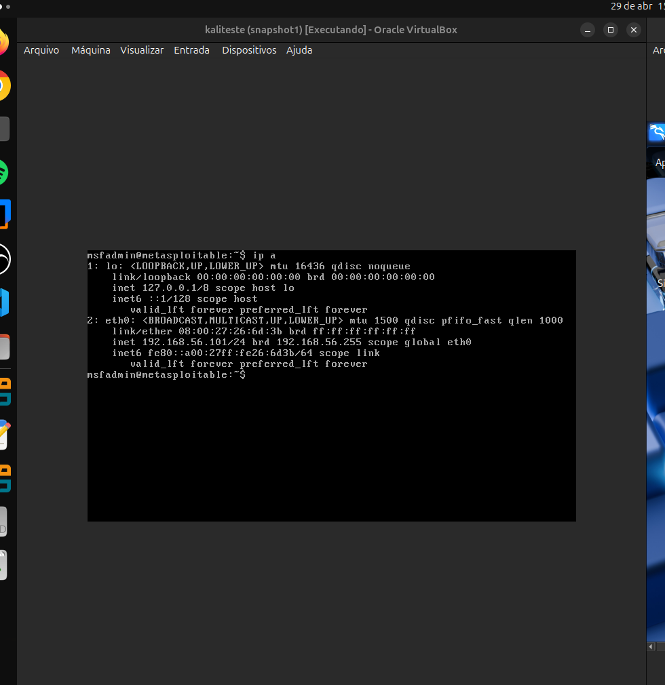
</div>

### Passo 2: Teste de Conectividade e Alcance de Rede.
Validei a comunicação entre o sistema atacante (Kali Linux) e o sistema alvo para garantir que não existam bloqueios de rede.
```Bash
ping -c 3 [ip_da_maquina_alvo]
```

<div style="text-align: center;">
  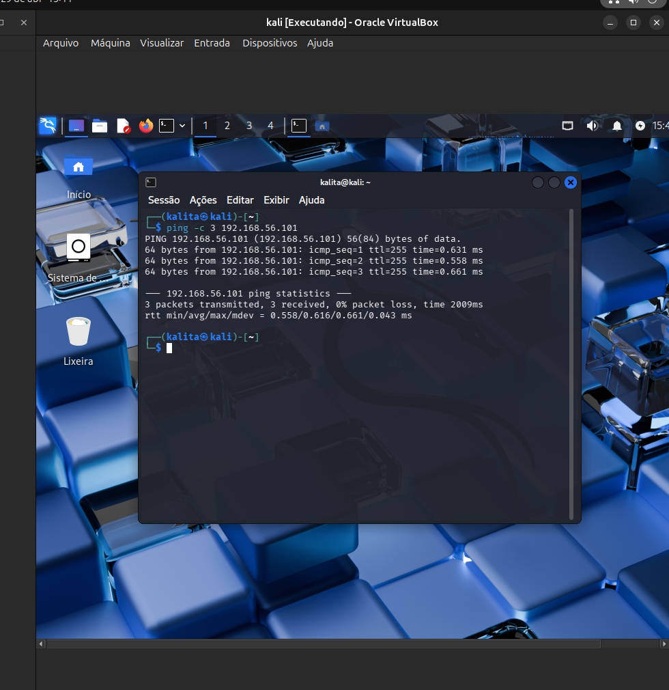
</div>

### Passo 3: Enumeração de Serviços com Nmap.
Realizei uma varredura nas portas principais para confirmar quais serviços estão ativos e identificar as versões dos protocolos (como FTP, SSH e SMB).
```Bash
sudo nmap -sV -p 21,22,80,445,139 [ip_da_maquina_alvo]
```

<div style="text-align: center;">
  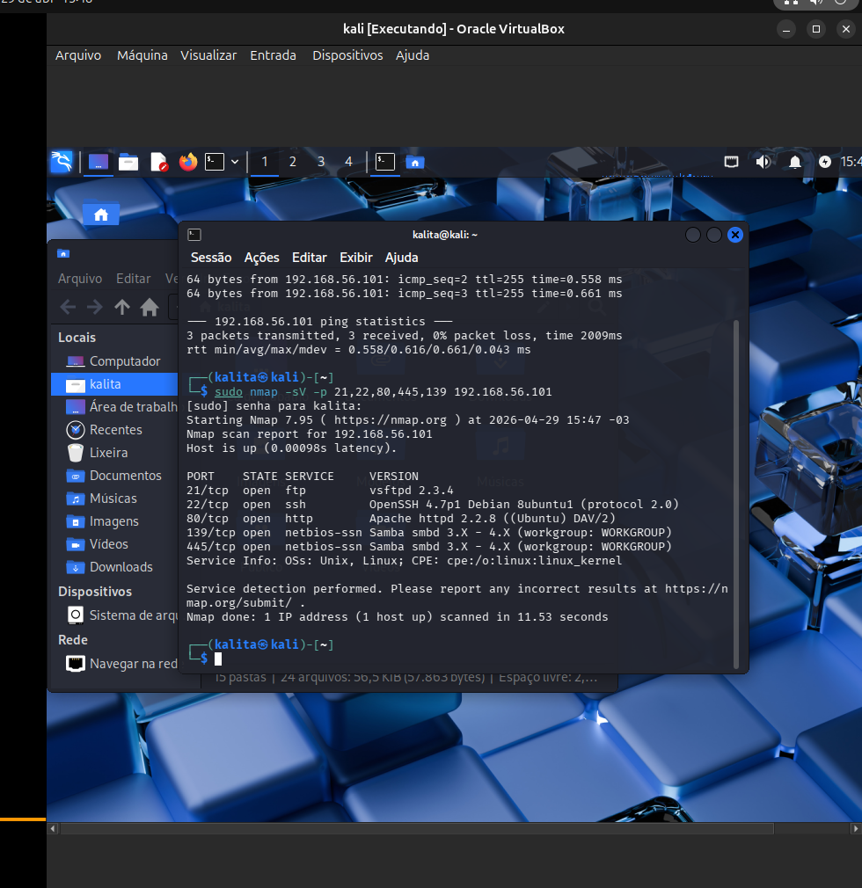
</div>

### Passo 4: Verificação Manual de Acesso.
Tentativa de conexão manual ao serviço FTP para validar o banner do serviço e confirmar que as credenciais padrão ou acesso anônimo não estão disponíveis.
```Bash
ftp [ip_da_maquina_alvo]
```

<div style="text-align: center;">
  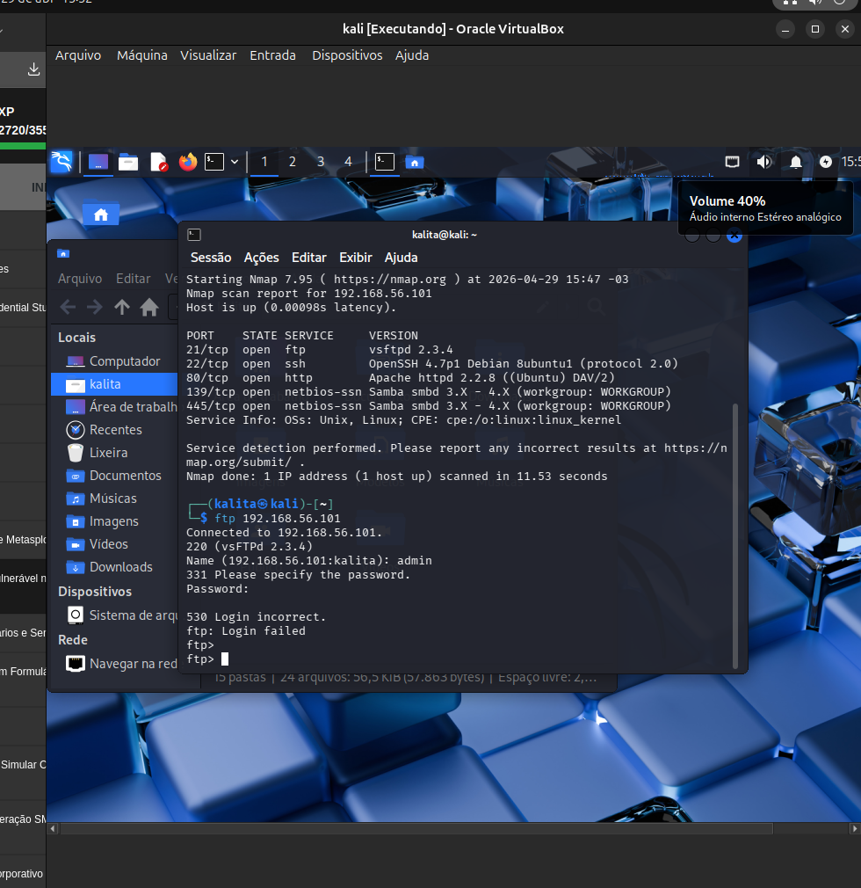
</div>

### Passo 5: Preparação de Dicionários.
Criação de listas personalizadas de usuários e senhas (Wordlists) baseadas em perfis comuns de sistemas Linux e credenciais padrão de fábrica.
```Bash
echo -e 'user\nmsfadmin\nadmin\nroot' > users.txt
echo -e '123456\npassword\nqwerty\nmsfadmin' > pass.txt
``` 
<div style="text-align: center;">
  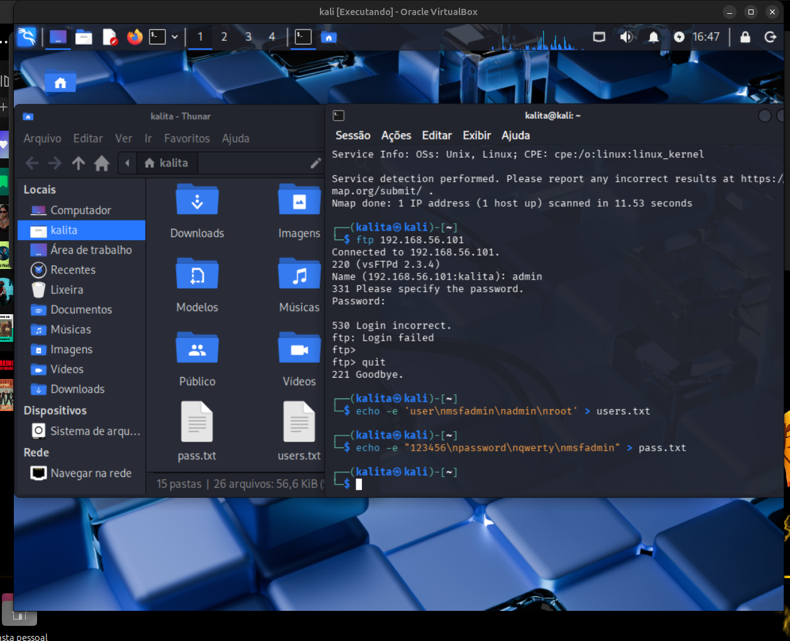
</div>

### Passo 6: Execução do Ataque de Força Bruta com Medusa.
Utilização da ferramenta ***Medusa*** para automatizar as tentativas de login no serviço FTP, utilizando paralelismo para acelerar a descoberta de credenciais válidas.
```Bash
medusa -h [ip_maquina_alvo] -U users.txt -P pass.txt -M ftp -t 6
```
<div style="text-align: center;">
  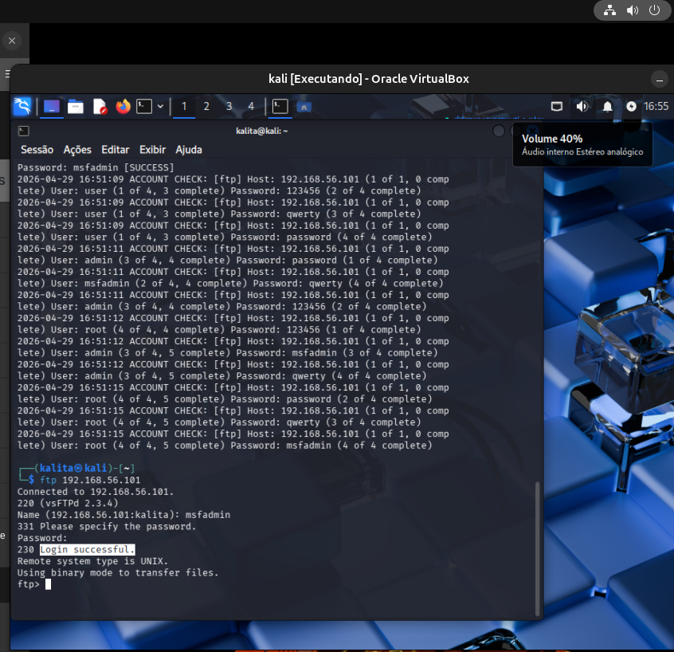
</div>

### Passo 7: Validação da Vulnerabilidade e Acesso Remoto.
Após a descoberta das credenciais, realizei o acesso final para confirmar a eficácia da auditoria e validar o nível de privilégio obtido no servidor.
``` Bash
ftp [ip_maquina_alvo]
```
<div style="text-align: center;">
  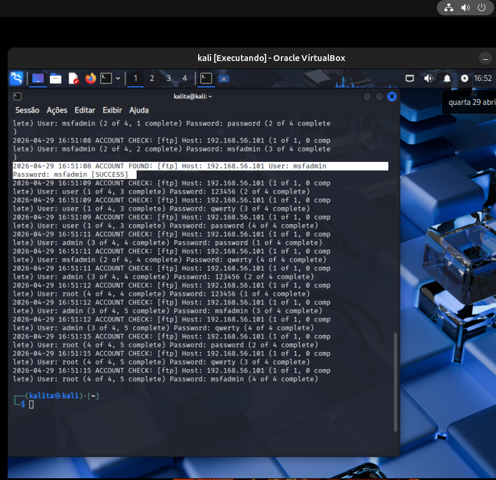
</div>


---

## 💀 Execução do Ataque: Automação de Formulário Web (DVWA)

Nesta etapa, simulei um ataque de força bruta contra uma aplicação web real (Damn Vulnerable Web App). O diferencial aqui é a necessidade de entender os campos do formulário para que a ferramenta saiba onde inserir as credenciais.

### Passo 1: Acesso à Aplicação Alvo.
Acessei a interface web do DVWA através do navegador para identificar o comportamento da página de autenticação. É importante que a sua vm tenha conexão com a internet.
```Bash
URL: http://[ip_da_maquina_alvo]/dvwa/login.php
```
<div style="text-align: center;">
  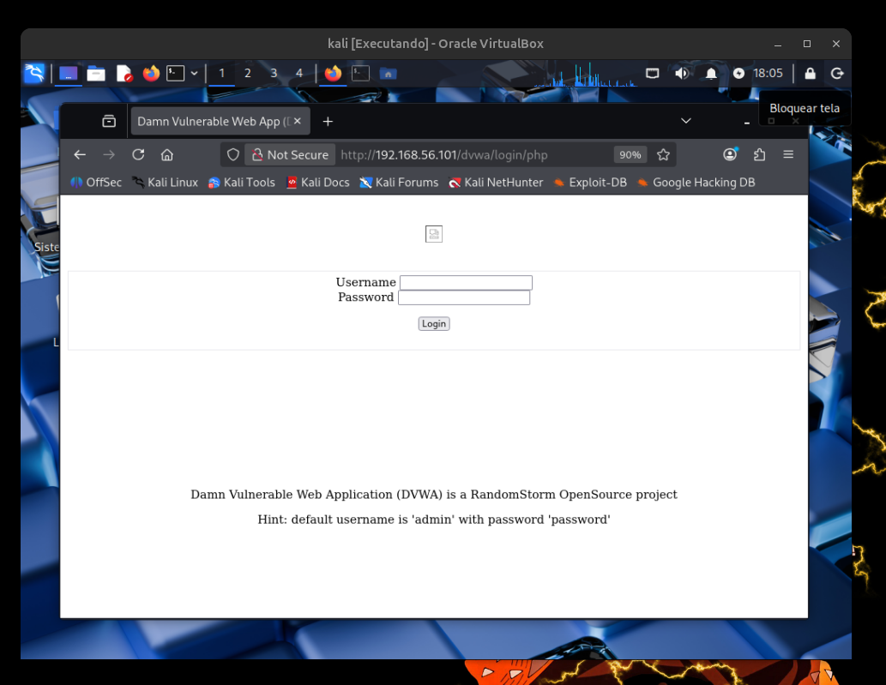
</div>

### Passo 2: Inspeção de Requisições HTTP.
Utilizei as ferramentas de desenvolvedor do navegador (F12 > Network) para capturar a requisição POST. Esse passo é fundamental para identificar o nome dos campos de entrada (username e password) e a mensagem de erro retornada pelo servidor em caso de falha.

<div style="text-align: center;">
  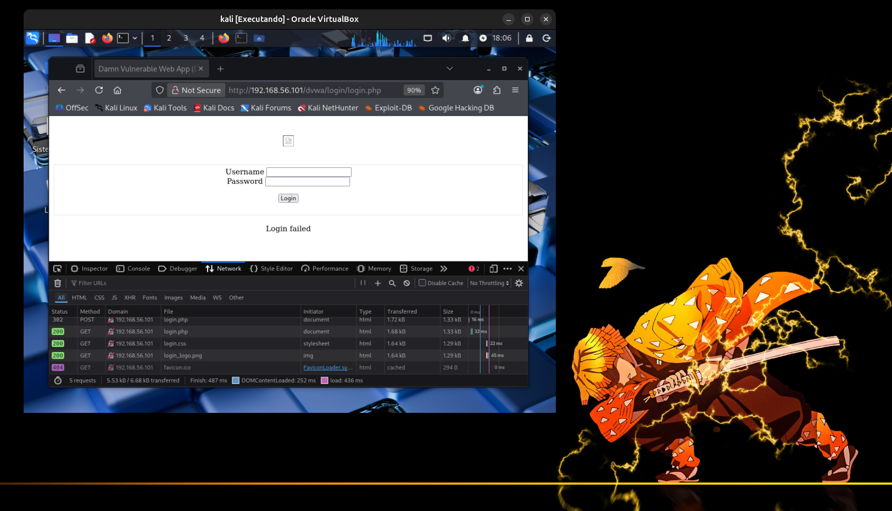
</div>

### Passo 3: Mapeamento de Parâmetros e Credenciais.
Com os dados da rede, mapeei os campos do formulário. Reutilizei as wordlists de usuários e senhas criadas anteriormente para alimentar o motor de ataque do ***Medusa***.

### Passo 4: Ataque de Força Bruta com Módulo HTTP
Executei o ***Medusa*** utilizando o módulo http. Configurei a página de login, os campos identificados no Passo 2 e a "assinatura de erro" (Login failed) para que a ferramenta saiba distinguir um login mal sucedido de um sucesso.
```Bash
medusa -h [ip_maquina_alvo] -U users.txt -P pass.txt -M http \
-m PAGE:'/dvwa/login.php' \
-m FORM:'username=^USER^&password=^PASS^&Login=Login' \
-m 'FAIL=Login failed' -t 6
```
📸 Galeria de Execução: Ataque Web (DVWA)

Para facilitar o acompanhamento do processo, as etapas de identificação e execução estão organizadas abaixo:

<div style=" test-align:center;">

| Etapa 1: Configuração do Ataque | Etapa 2: Resultados do Brute Force |
|:---:|:---:|
| 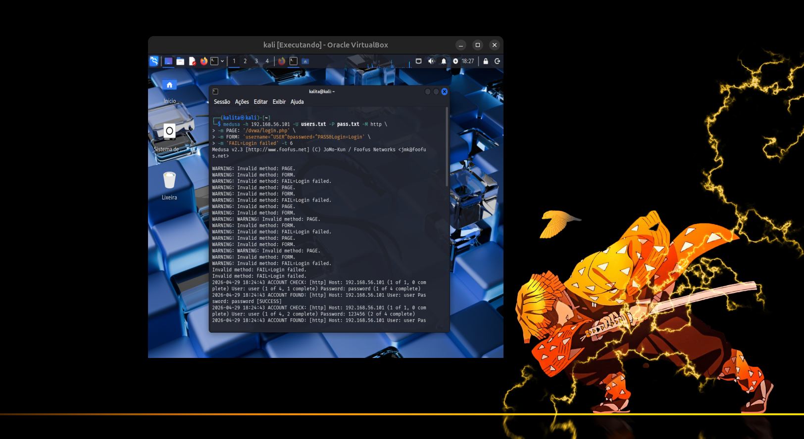<br><sup>Definição de parâmetros e início do Medusa</sup> | 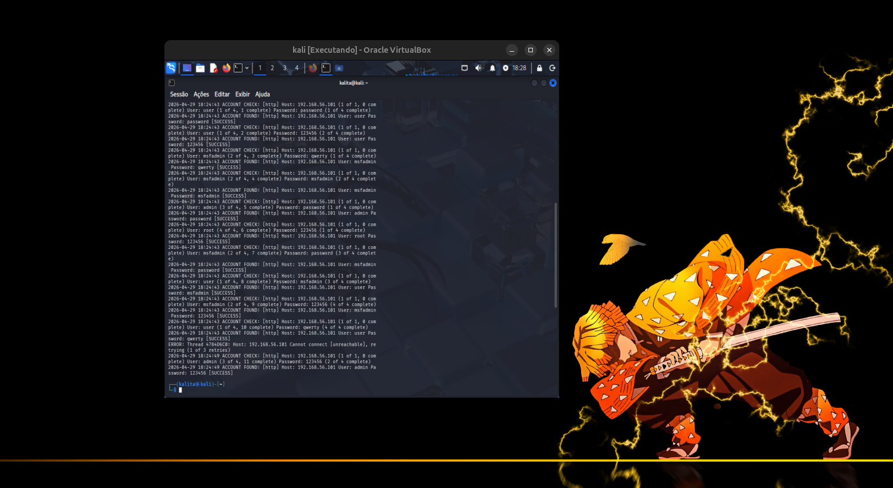<br><sup>Identificação de múltiplas credenciais válidas</sup> |
| **Etapa 3: Validação Manual** | **Etapa 4: Acesso Concedido** |
| 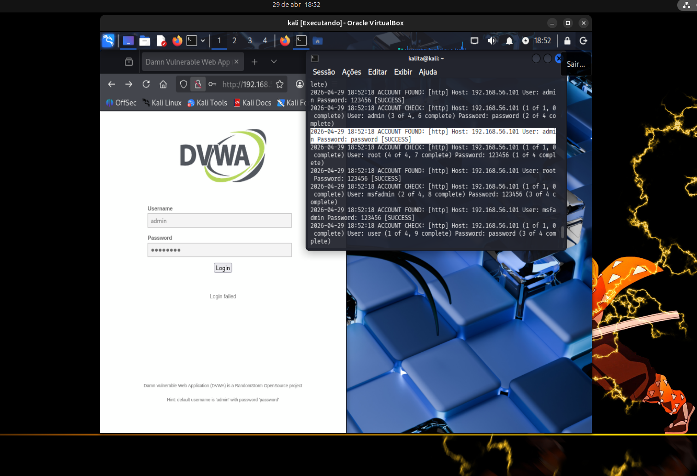<br><sup>Inserindo usuário e senha encontrados</sup> | 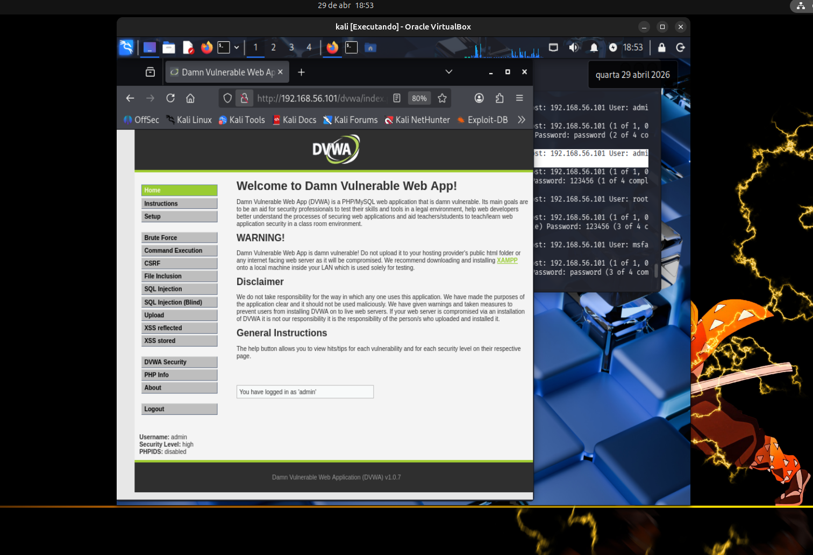<br><sup>Painel administrativo logado com sucesso</sup> |

</div>

---

## 🥷 Execução do Ataque: Password Spraying em SMB

Diferente do brute force tradicional, o ***Password Spraying*** é uma técnica ***"ninja"*** de ataque furtivo. Em vez de tentar milhares de senhas em um único usuário (o que bloquearia a conta rapidamente), testei uma única senha comum contra uma lista inteira de usuários.

### Passo 1: Enumeração de Usuários e Serviços.
Antes do ataque, precisei saber quem são os "moradores" do sistema. Utilizei o ***enum4linux*** para extrair informações do protocolo ***SMB*** e descobrir nomes de usuários válidos, otimizando o tempo do ataque.
```Bash
enum4linux -a [IP_ALVO] | tee enum4_output.txt
```
<div style="text-align: center;">

| Etapa 1: Executar e gravar resultados | Etapa 2: abrir o arquivo para ver |
|:---:|:---:|
| 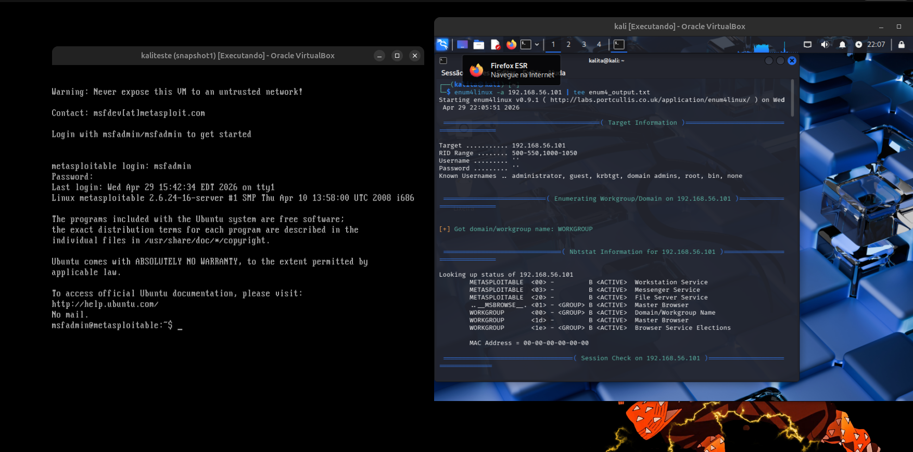<br><sup>Comando que faz o trabalho pesado.</sup> | 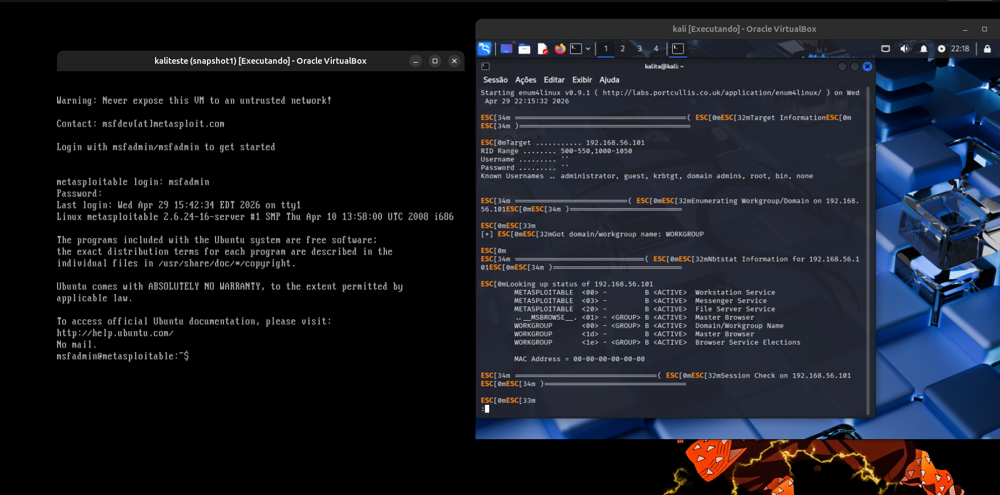<br><sup>Comando leitor dos arquivos.</sup> |

</div>

### Passo 2: Preparação do Alvo (Wordlists).
Com base nos dados coletados, criei as listas de usuários e a senha que será pulverizada **(sprayed)** na rede.
``` Bash
echo -e "user\nmsfadmin\nservice" > smb_users.txt
echo -e 'msfadmin\npassword\n123456\nWelcome123' > senhas_spray.txt
```
<div style="text-align: center;">
  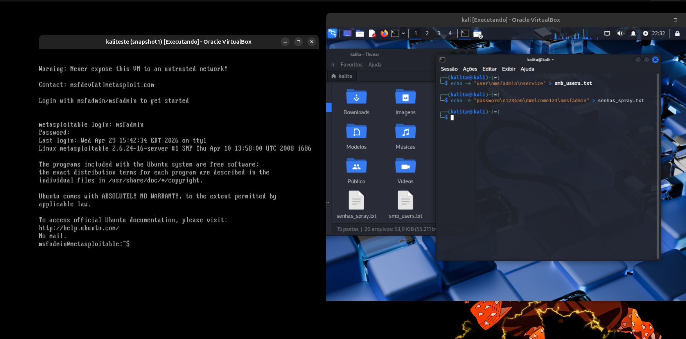
</div>

### Passo 3: Ataque com Medusa (Módulo smbnt).
Executei o ataque utilizando o módulo ***smbnt***. Configurei um tempo de espera entre as tentativas para manter o comportamento furtivo. #ComoUmNinja
```Bash
medusa -h [IP_ALVO] -U smb_users.txt -P senhas_spray.txt -M smbnt -t 2 -T 50
```
<div style="text-align: center;">
  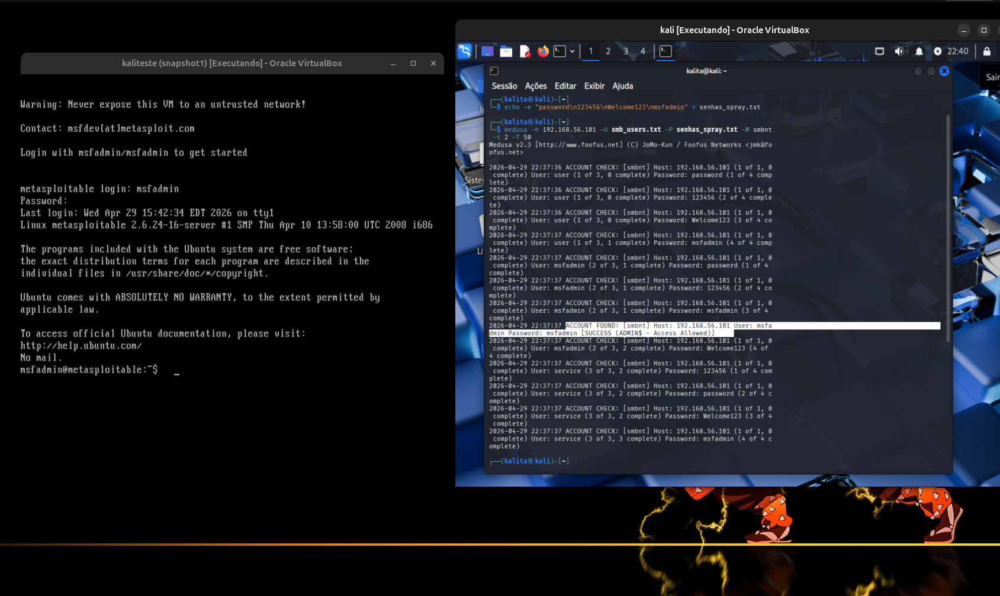
</div>

### Passo 4: Validação do Acesso com smbclient.
Para confirmar que as credenciais obtidas são válidas e ver os compartilhamentos disponíveis, utilizei o ***smbclient***.
```Bash
smbclient -L //[IP_ALVO] -U msfadmin
```
<div style="text-align: center;">
  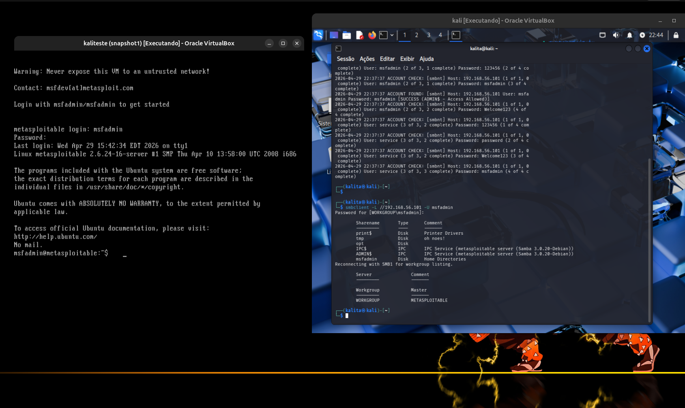
</div>

---

### 🏁 Considerações Finais: 

A realização deste projeto permitiu simular o ciclo de vida de ataques comuns que ocorrem diariamente em infraestruturas corporativas. Através do ***FTP Brute Force, do Web Form Attack e do SMB Password Spraying,*** foi possível observar como credenciais fracas e serviços mal configurados são portas de entrada fáceis para atacantes.


🧠 ***Principais Aprendizados:***

* Furtividade vs. Velocidade: O Password Spraying é mais eficaz para evitar bloqueios do que o brute force comum.
* Importância da Enumeração: Sem a fase inicial de reconhecimento (Nmap/enum4linux), o ataque é ineficaz.
* Segurança em Camadas: Mitigar um serviço não basta se outros protocolos (como SMB) utilizam as mesmas credenciais.


### ⚖️ Ética e Responsabilidade:

*Este laboratório foi executado em um ambiente controlado e isolado (VirtualBox), com o único propósito de estudo e fortalecimento de defesas. O conhecimento técnico adquirido é uma ferramenta para construir sistemas mais resilientes e proteger dados sensíveis.*